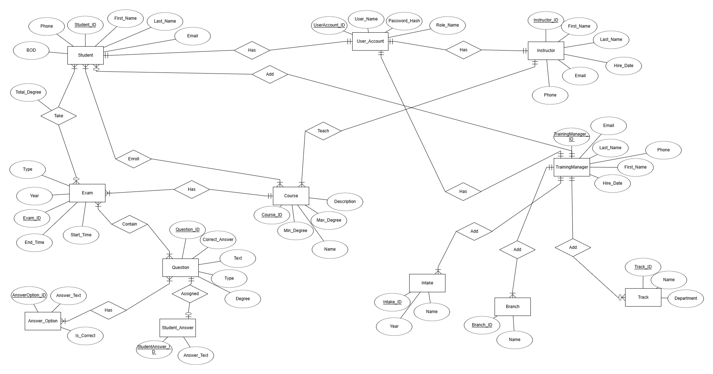
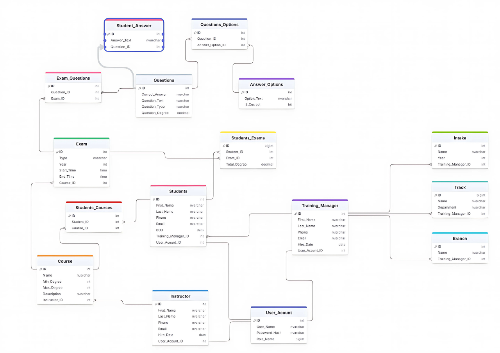

# Examination System Database Project

## 📌 Overview
This project is a complete **Database Design and Implementation** for an **Examination System**.  
It covers **Entity-Relationship design, database schema creation, sample data insertion, and SQL queries** to manage and retrieve data efficiently.

The system is intended to manage:
- Student and exam information
- Question banks
- Exam scheduling
- Results storage and retrieval

---

## 📂 Project Structure

```
Examination_System_DB_Project/
│
├── DB_Design/                 # Database design assets
│   ├── ES_ERD.png              # Entity Relationship Diagram
│   ├── ES_SCHEMA.png           # Database schema diagram
│   └── Schema_DEPI_SQL.png     # Schema in DEPI SQL visual format
│
├── SQL/                        # SQL scripts
│   ├── ES_DDL.sql              # Database creation (tables, constraints)
│   ├── ES_DML.sql              # Data insertion scripts
│   └── ES_Queries.sql          # Example queries for the system
│
├── Team_Info/
│   └── Graduation Team.pdf     # Team members and project contributors
│
├── Text_Files_Deliverables/    # Supporting documentation
│   ├── DB_Accounts_and_Passwords.txt  # Database user accounts
│   ├── DB_Objects_Description.txt     # Description of tables & relationships
│   └── Test_Queries_and_Results.txt   # Queries with expected results
```

---

## 🛠 Requirements
- **Database**: Oracle / MySQL / PostgreSQL (depending on project requirements)
- **SQL Client**: Any SQL execution tool such as:
  - Oracle SQL Developer
  - MySQL Workbench
  - pgAdmin (for PostgreSQL)

---

## 🚀 How to Use

1. **Create the Database**
   - Run the `ES_DDL.sql` file to create all tables and constraints.

2. **Insert Sample Data**
   - Execute the `ES_DML.sql` file to populate the database with sample data.

3. **Run Queries**
   - Use `ES_Queries.sql` to test and interact with the database.

---

## 📊 Database Design

- **Entity-Relationship Diagram**  
  

- **Database Schema**  
  

---

## 👥 Contributors
Details about the team members can be found in  
`Team_Info/Graduation Team.pdf`

---

## 📄 License
This project is intended for **educational purposes** and can be reused or adapted with proper attribution.
